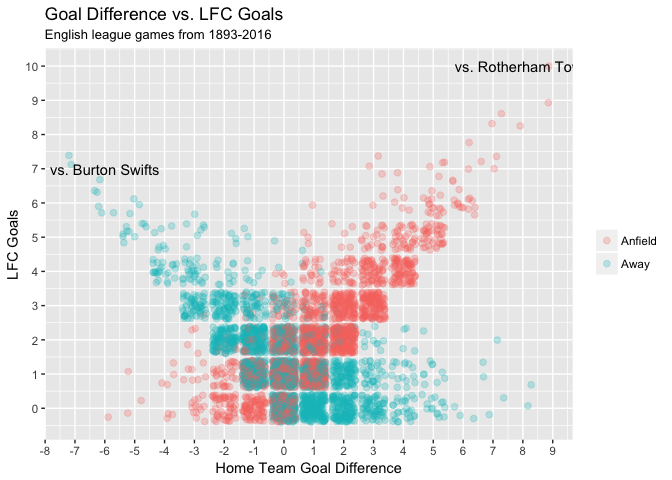
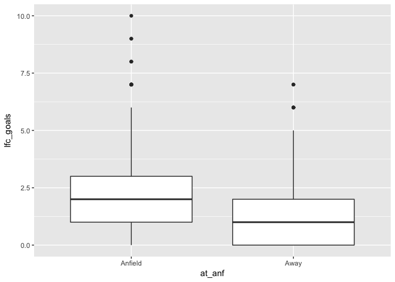
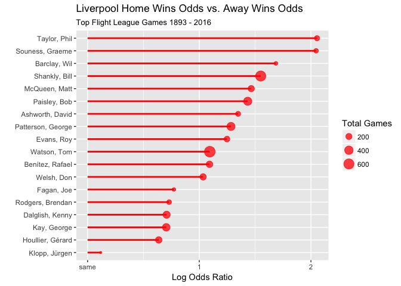

Liverpool FC: Manager Analysis
================

``` r
#install.packages("engsoccerdata")
library(engsoccerdata, quietly = T)
library(tidyverse, quietly = T)
```

    ## ── Attaching packages ───────────────────────────────────────────────────────────────────── tidyverse 1.2.1 ──

    ## ✔ ggplot2 2.2.1     ✔ purrr   0.2.4
    ## ✔ tibble  1.4.2     ✔ dplyr   0.7.4
    ## ✔ tidyr   0.8.0     ✔ stringr 1.2.0
    ## ✔ readr   1.1.1     ✔ forcats 0.2.0

    ## ── Conflicts ──────────────────────────────────────────────────────────────────────── tidyverse_conflicts() ──
    ## ✖ dplyr::filter() masks stats::filter()
    ## ✖ dplyr::lag()    masks stats::lag()

``` r
library(lubridate, quietly = T)
```

    ## 
    ## Attaching package: 'lubridate'

    ## The following object is masked from 'package:base':
    ## 
    ##     date

``` r
library(stringr, quietly = T)
library(rvest, quietly = T)
```

    ## 
    ## Attaching package: 'rvest'

    ## The following object is masked from 'package:purrr':
    ## 
    ##     pluck

    ## The following object is masked from 'package:readr':
    ## 
    ##     guess_encoding

Purpose
-------

Making the Liverpool Managers Dataset
-------------------------------------

The managers and the years they managed Liverpool FC are scraped from the [Wikipedia page for LFC managers](https://en.wikipedia.org/wiki/List_of_Liverpool_F.C._managers).

``` r
site <- 
  read_html("https://en.wikipedia.org/wiki/List_of_Liverpool_F.C._managers")

mtable <- site %>%
  html_nodes("table") %>%
  .[[3]] %>%
  html_table(fill = T) %>%
  as_tibble()

mngrs_clean <- mtable %>%
  select(-Notes) %>%
  filter(row_number() != 1)

# Remove zeros
mngrs_clean$From <- str_sub(mngrs_clean$From, 9, 18)
mngrs_clean$To <- str_sub(mngrs_clean$To , 9, 18)
mngrs_clean$P <- str_sub(mngrs_clean$P, 21)
mngrs_clean$W <- str_sub(mngrs_clean$W, 21)
mngrs_clean$D <- str_sub(mngrs_clean$D, 21)
mngrs_clean$L <- str_sub(mngrs_clean$L, 21)
mngrs_clean$`Win %` <- str_sub(mngrs_clean$`Win %`, 21)

# Convert From and To to dates
mngrs_clean <- mngrs_clean %>%
  mutate(From = as.Date(From)) %>%
  mutate(To = as.Date(To)) %>% 
  mutate(To = ifelse(is.na(To), Sys.Date(), To))

# Convert manager names to last, first format
s <- str_split_fixed(mngrs_clean$Name, " ", n = Inf)
s2 <- str_sub(s[, 2], 1, .5 * nchar(s[, 2]))
newstrings <- cbind(s, s2)
newstrings_names <- paste(newstrings[, 1], newstrings[,"s2"])

mngrs_clean$Name <- newstrings_names
```

We'll work with the English football dataset from the `engsoccerdata` to create a dataframe of Liverpool games and then we'll populate a new `mngr` column with the names of managers we got from Wikipedia.

``` r
# Subset Liverpool home and away games
lfc <- england %>%
  filter(home == "Liverpool" | visitor == "Liverpool") %>% 
  mutate(Date = as.Date(Date)) %>%
  arrange(Date)

# Create a new column for managers
lfc_mngrs <- lfc %>%
  as_tibble() %>%
  mutate(mngr = "")

# TODO rework this as a function
# Loop to add the rest of the managers
for (i in 1:nrow(mngrs_clean)) {
 lfc_mngrs <- lfc_mngrs %>% 
  mutate(mngr = ifelse(
    Date >= mngrs_clean$From[i] & Date <= mngrs_clean$To[i], 
    mngrs_clean$Name[i], 
    mngr
    ))
}
```

There are still a handful of years that don't have a manager assigned, so we'll store them in this dataframe to be dealt with at a different time.

``` r
# Store records with no manager here
no_mngr <- filter(lfc_mngrs, mngr == "")

nrow(no_mngr)
```

    ## [1] 17

To make it easier to look at the goals that Liverpool scored in each game and whether or not the games were at Anfield, we'll add columns for LFC goals and if the game was played at Anfield.

``` r
# New goals column and at Anfield column
lfc_mngrs <- lfc_mngrs %>% 
  mutate(
    lfc_goals = 0, 
    lfc_goals = ifelse(home == "Liverpool", hgoal, vgoal), 
    at_anf = "", 
    at_anf = ifelse(home == "Liverpool", "Anfield", "Away")
    )
```

Exploratory Analysis
--------------------

Note here that goal difference is calculated by subtracting the number of goals that the visiting team scored from the number of goals that the home team scored, making it effectively the goal difference of the home team.

Liverpool have won by some big margins at Anfield and they've never been able to match their best winning goal differences away from home. The largest margin Liverpool have won by at home was against Rotherham Town. The largest they won by while away was against Burton Swifts.

``` r
gdiff <- lfc_mngrs$goaldif

ggplot(data = lfc_mngrs, aes(y = lfc_goals, x = goaldif, color = at_anf)) + 
  scale_color_discrete(guide_legend(title = "")) +
  geom_point(alpha = .25, position = "jitter", size = 2) + 
  scale_y_continuous(breaks = c(0:10)) +
  scale_x_continuous(breaks = c(-10:10)) +
  annotate("text", 
           max(gdiff) - 1, 
           lfc_mngrs$lfc_goals[which.max(gdiff)], 
           label = paste("vs.", lfc_mngrs$visitor[which.max(gdiff)])) +
  annotate("text", 
           min(gdiff) + 1, 
           lfc_mngrs$lfc_goals[which.min(gdiff)], 
           label = paste("vs.", lfc_mngrs$home[which.min(gdiff)])) +
  labs(title = "Goal Difference vs. LFC Goals", 
       subtitle = "English league games from 1893-2016", 
       x = "Home Team Goal Difference", 
       y = "LFC Goals")
```



``` r
#qplot(lfc_goals, data = lfc_mngrs, facets = ~mngr, binwidth = 1)
group_by(lfc_mngrs, mngr) %>% 
  mutate(n = n()) %>% 
  ungroup() %>% 
  filter(n >= 38) %>% 
  ggplot(aes(x = lfc_goals)) + 
  geom_histogram(bins = 20) + 
  scale_x_continuous(seq(0, 10, by = 1)) +
  coord_cartesian(c(0, 7)) +
  facet_wrap(~ mngr) + 
  labs(title = "Distribution of Goals Scored", 
       x = "Goals", y = "")
```


``` r
ggplot(data = lfc_mngrs, aes(y = lfc_goals, x = c(1:nrow(lfc_mngrs)), color = mngr)) + 
  geom_point(alpha = .5, position = "jitter")
```


Whether or not Liverpool were playing at Anfield could be associated with the number of goals Liverpool scored.

``` r
ggplot(data = lfc_mngrs, aes(y = lfc_goals, x = c(1:nrow(lfc_mngrs)), color = at_anf)) + 
  geom_point(alpha = .5, position = "jitter")
```


``` r
ggplot(data = lfc_mngrs, aes(y = lfc_goals, x = at_anf)) + 
  geom_boxplot()
```



``` r
mngr_avg <- lfc_mngrs %>% 
  group_by(mngr) %>% 
  summarise(n = n(), goal_avg = mean(lfc_goals)) %>% 
  arrange(desc(goal_avg))
```

Comparing Win Ratios
--------------------

``` r
win_ratios <- lfc_mngrs %>% 
  mutate(win = 0,
         win = ifelse(home == "Liverpool" & result == "H", 1, win), 
         win = ifelse(visitor == "Liverpool" & result == "A", 1, win)) %>% 
  select(mngr, at_anf, win) %>% 
  group_by(mngr) %>% 
  summarise(total_hwins = sum(at_anf == "Anfield" & win == 1), 
            total_hgames = sum(at_anf == "Anfield"), 
            total_awins = sum(at_anf != "Anfield" & win == 1), 
            total_agames = sum(at_anf != "Anfield")) %>% 
  ungroup() %>% 
  mutate(h_odds = (total_hwins / total_hgames) / (1 - total_hwins / total_hgames), 
         a_odds = (total_awins / total_agames) / (1 - total_awins / total_agames), 
         log_odds_ratio = log(h_odds / a_odds)) %>% 
  filter(total_hgames + total_agames >= 30)
```

Write the win ratios data set and the Liverpool managers dataset as CSVs.

``` r
# Write win ratios data set
write_csv(win_ratios, "output/lfc_win_ratios.csv")

# Write LFC managers dataset 
write_csv(lfc_mngrs, "output/lfc_manager_games.csv")
```

``` r
ggplot(data = win_ratios, aes(x = reorder(mngr, log_odds_ratio), 
                              y = log_odds_ratio)) + 
  geom_point(aes(size = total_hgames + total_agames), 
             alpha = .75, color = "red") + 
  geom_segment(aes(x = mngr, xend = mngr, y = 0, yend = log_odds_ratio), 
               size = 1, color = "red") +
  coord_flip() + 
  scale_y_continuous(breaks = seq(-1, 2), labels = c("-1", "same", "1", "2")) +
  labs(title = "Liverpool Home Wins Odds vs. Away Wins Odds", 
       subtitle = "Top Flight League Games 1893 - 2016", 
       x = "", y = "Log Odds Ratio", size = "Total Games")
```



``` r
ggsave("output/home_away.png")
```

    ## Saving 7 x 5 in image

Test `win_ratio` by looking at Bob Paisley's number of home and away games.

``` r
bp <- lfc_mngrs %>% 
  mutate(win = 0,
         win = ifelse(home == "Liverpool" & result == "H", 1, win), 
         win = ifelse(visitor == "Liverpool" & result == "A", 1, win)) %>% 
  filter(mngr == "Paisley, Bob") 

summarise(bp, home_games = sum(at_anf == "Anfield"),
              away_games = sum(at_anf != "Anfield"),
              home_wins = sum(at_anf == "Anfield" & win == 1), 
              away_wins = sum(at_anf != "Anfield"&  win == 1))
```

    ## # A tibble: 1 x 4
    ##   home_games away_games home_wins away_wins
    ##        <int>      <int>     <int>     <int>
    ## 1        188        187       137        73
